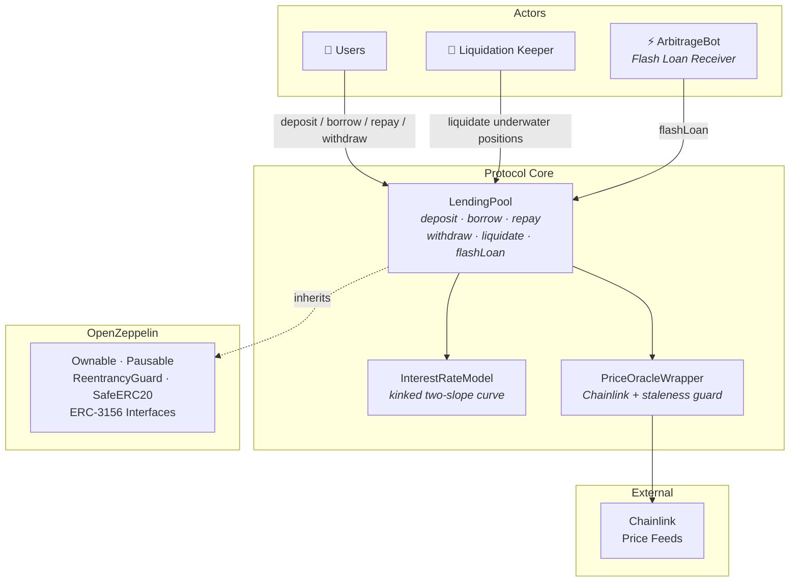

# DeFi Lending Protocol

[](https://github.com/NicoMM8/defi-lending-protocol/actions/workflows/test.yml)
[](https://soliditylang.org/)
[](./LICENSE)

A fully-featured **decentralized lending protocol** built on Solidity, featuring dynamic interest rates, Chainlink oracle integration, partial liquidations, and ERC-3156 flash loans.

Inspired by the architecture of [Aave](https://aave.com) and [Compound](https://compound.finance), this project demonstrates production-grade DeFi patterns including WAD fixed-point arithmetic, multi-asset health factor calculations, and off-chain keeper bots.

---

## Architecture



---

## Features

| Feature | Implementation |
|---|---|
| **Dynamic Interest Rates** | Two-slope kinked model — gentle below 80% utilization, steep above. Rates accrue per-second via a compounding `borrowIndex`. |
| **Chainlink Price Feeds** | All prices normalized to 18 decimals (WAD). Oracle includes a configurable **staleness guard** (default: 1 hour) to reject outdated data. |
| **Health Factor** | Multi-asset HF computed as: `Σ(collateral × price × LTV) / Σ(debt × price)`. Positions with HF < 1.0 are eligible for liquidation. |
| **Partial Liquidations** | **Close Factor (50%)** limits each liquidation call to half the outstanding debt, preventing full position wipeout in a single transaction. |
| **Reserve Factor (10%)** | Protocol retains 10% of accrued interest as reserves. Remaining 90% flows to depositors via the supply rate. |
| **Supply APY** | `supplyRate = borrowRate × utilization × (1 − reserveFactor)` — depositors earn yield automatically. |
| **Flash Loans (ERC-3156)** | Uncollateralized loans with a 0.09% fee, repaid atomically within the same transaction. |
| **Emergency Controls** | `Ownable` for admin functions, `Pausable` for circuit-breaking all user operations. |
| **Reentrancy Protection** | All state-changing functions protected via OpenZeppelin's `ReentrancyGuard`. |

---

## Project Structure

```
contracts/
├── LendingPool.sol              Core protocol: deposit, borrow, repay, withdraw, liquidate, flashLoan
├── InterestRateModel.sol        Kinked (two-slope) interest rate mathematics
├── PriceOracleWrapper.sol       Chainlink integration with staleness protection
├── ArbitrageBot.sol             Flash loan receiver — arbitrage demo
├── MaliciousFlashBorrower.sol   Security test: verifies unpaid flash loans revert
├── MockAggregator.sol           Test helper: simulates Chainlink price feeds
└── MockERC20.sol                Test helper: mintable ERC-20 token

scripts/
├── deploy.js                    Full protocol deployment → deployed-addresses.json
├── arbitrageSimulation.js       End-to-end flash loan arbitrage demo
├── liquidationSimulation.js     Liquidation flow with Close Factor demo
└── liquidationBot.js            Off-chain keeper bot (Node.js)

test/
└── DeFiProtocol.test.js         28 test cases across 11 categories

.github/workflows/
└── test.yml                     CI: compile + test on push/PR
```

---

## Quick Start

```bash
# Clone and install
git clone https://github.com/NicoMM8/defi-lending-protocol.git
cd defi-lending-protocol
npm install

# Compile contracts
npx hardhat compile

# Run the full test suite (28 tests)
npm test

# Deploy locally
npx hardhat run scripts/deploy.js

# Run simulations
npm run simulate:arb    # Flash loan arbitrage
npm run simulate:liq    # Liquidation with Close Factor
```

---

## Interest Rate Model

The protocol uses a **kinked (two-slope) model** inspired by Aave and Compound. Borrowing rates remain low under normal utilization but increase sharply when the pool approaches full utilization, incentivizing repayments.

$$
R_{borrow} = \begin{cases}
R_{base} + \dfrac{U}{U_{optimal}} \times S_1 & \text{if } U \leq U_{optimal} \\[8pt]
R_{base} + S_1 + \dfrac{U - U_{optimal}}{1 - U_{optimal}} \times S_2 & \text{if } U > U_{optimal}
\end{cases}
$$

| Parameter | Value | Description |
|---|---|---|
| $U_{optimal}$ | 80% | Target utilization rate (kink point) |
| $R_{base}$ | 2% | Minimum annual borrow rate |
| $S_1$ | 4% | Slope below the kink |
| $S_2$ | 75% | Slope above the kink (steep) |

**Supply Rate** is derived as:

$$R_{supply} = R_{borrow} \times U \times (1 - RF)$$

where $RF = 10\%$ is the reserve factor.

---

## Security Considerations

| Mechanism | Purpose |
|---|---|
| **Ownable** | Only the deployer can add markets, pause the protocol, and configure oracle feeds |
| **Pausable** | Emergency circuit breaker — halts all user-facing operations |
| **ReentrancyGuard** | Prevents reentrancy on every external call that modifies state |
| **Oracle Staleness** | Configurable `maxStaleness` (default: 3600s) rejects stale Chainlink data |
| **Close Factor** | 50% cap per liquidation call prevents flash-liquidation attacks |
| **WAD Arithmetic** | All calculations use 18-decimal fixed-point math (1e18) to avoid precision loss |

> **Disclaimer**: This protocol is built for educational and portfolio purposes. It has not been professionally audited. Do not use in production without a thorough security review.

---

## Test Coverage

```
DeFi Lending Protocol
  Setup & Access Control ────────── 5 tests
  Pausable ──────────────────────── 2 tests
  Oracle Staleness ──────────────── 2 tests
  Deposits ──────────────────────── 2 tests
  Borrow ────────────────────────── 3 tests
  Repay ─────────────────────────── 2 tests
  Withdraw ──────────────────────── 2 tests
  Interest Accrual & Supply Rate ── 3 tests
  Liquidation (Close Factor) ────── 2 tests
  Flash Loans ───────────────────── 3 tests
  Health Factor Edge Cases ──────── 2 tests

  28 passing (2s)
```

---

## Built With

- [Solidity ^0.8.20](https://soliditylang.org/) — Smart contract language
- [Hardhat](https://hardhat.org/) — Development and testing framework
- [OpenZeppelin Contracts v5](https://www.openzeppelin.com/contracts) — Security primitives and ERC standards
- [Chainlink](https://chain.link/) — Decentralized oracle price feeds
- [Ethers.js v6](https://docs.ethers.org/) — Ethereum interaction library

---

## License

This project is licensed under the [MIT License](./LICENSE).
